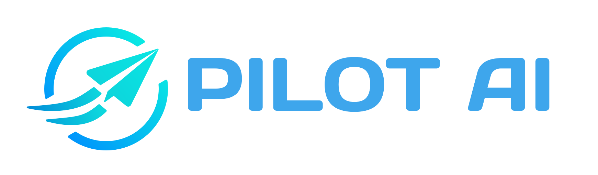

<p align="center">
  <picture>
    <source media="(prefers-color-scheme: dark)" srcset="design/logo_dark.svg" />
    <source media="(prefers-color-scheme: light)" srcset="design/logo_light.svg" />
    
  </picture>
</p>

<p align="center">
  <strong>Personal AI agent that controls your macOS via Slack or Telegram</strong>
</p>

<p align="center">
  <a href="https://www.npmjs.com/package/pilot-ai"></a>
  <a href="https://www.npmjs.com/package/pilot-ai"></a>
  
  
  <a href="LICENSE"></a>
</p>

---

Pilot-AI is a local AI agent that lives on your Mac. Send it natural-language commands from **Slack** or **Telegram**, and it autonomously controls your browser, files, shell, GitHub, Notion, and more — powered by [Claude Code](https://code.claude.com/) CLI.

## How it works

```
┌──────────────────┐     ┌─────────────────┐     ┌──────────────────────┐
│  Slack / Telegram │────▶│   Pilot-AI Agent │────▶│   Claude Code CLI     │
│  (your phone/PC)  │◀────│   (local daemon) │◀────│   (agentic reasoning) │
└──────────────────┘     └────────┬────────┘     └──────────────────────┘
                                  │
                    ┌─────────────┼─────────────┐
                    ▼             ▼             ▼
              🌐 Browser    📁 Files      🔧 Shell
              (Playwright)  (Read/Write)  (Bash/Git/gh)
                    ▼             ▼             ▼
              📝 Notion     🔗 GitHub     📋 Linear
              (API)         (CLI)         (API)
                    ▼             ▼             ▼
              📧 Gmail      📅 Calendar  📁 Google Drive
              (OAuth2)      (OAuth2)      (OAuth2)
```

- **Runs locally** — your data never leaves your machine
- **Always on** — managed by macOS launchd, auto-restarts on crash
- **Agentic** — doesn't just answer, it investigates, acts, and follows through
- **Secure** — user allowlist, dangerous action approval, macOS Keychain for secrets

## Features

- **Messenger integration** — Slack (Socket Mode) or Telegram (Long Polling), no server needed
- **Browser automation** — navigate, click, screenshot, fill forms via Playwright
- **File & shell access** — read, write, search files and run shell commands
- **GitHub integration** — releases, PRs, issues via `gh` CLI
- **Notion integration** — search, create, update pages and databases
- **Google integration** — Gmail, Google Calendar, and Google Drive via OAuth2
- **MCP auto-discovery** — agent detects needed MCP servers and proposes installation with one-click approval
- **Scheduled tasks** — cron-like jobs with natural language scheduling
- **Skills system** — teach the agent reusable procedures
- **Project awareness** — resolves projects, remembers context per project
- **Live status updates** — see what the agent is doing in real-time (🔍 Searching code... ⚡ Running command...)
- **Credential management** — agent can request and store API keys via chat
- **Safety controls** — dangerous actions require explicit approval via messenger buttons

## Prerequisites

- **macOS** (launchd is macOS-only)
- **Node.js** >= 18
- **Claude Code CLI** — install and authenticate:
  ```bash
  npm install -g @anthropic-ai/claude-code
  claude  # login with your Claude Pro/Max account
  ```

## Quick Start

### 1. Install

```bash
npm install -g pilot-ai
```

### 2. Setup

```bash
pilot-ai init
```

The interactive wizard guides you through:

1. **Claude connection** — detects CLI auth or configures API key
2. **Messenger** — choose Slack or Telegram, enter tokens
3. **Integrations** — optionally connect Google (Gmail, Calendar, Drive), Notion, Obsidian, Figma, Linear
4. **Browser** — installs Playwright Chromium
5. **Permissions** — requests macOS permissions (Accessibility, Automation, etc.)

### 3. Start

```bash
pilot-ai start
```

That's it. Open Slack or Telegram and start chatting with your agent.

### Follow logs in real-time

```bash
pilot-ai start -f
# or
pilot-ai logs -f
```

## Usage Examples

Just message your agent in Slack or Telegram:

| Command | What happens |
|---------|-------------|
| `What projects are in ~/Github?` | Lists directories, shows project names |
| `Show me recent releases for fridgify` | Finds the repo, runs `gh release list` |
| `Create today's meeting notes in Notion` | Creates a new Notion page with meeting notes |
| `Open browser and show top 5 from Hacker News` | Opens Playwright, scrapes HN, reports results |
| `Every day at 9am, notify me of GitHub PR reviews` | Creates a scheduled cron job |
| `Check my Google Calendar for today's schedule` | Reads Google Calendar events and summarizes |
| `Send a draft email to john@example.com` | Composes a Gmail draft with the given content |
| `List files in my Google Drive "Projects" folder` | Browses Google Drive and lists folder contents |

## CLI Reference

```bash
pilot-ai init          # Interactive setup wizard
pilot-ai start [-f]    # Start agent daemon (-f to follow logs)
pilot-ai stop          # Stop agent daemon
pilot-ai status        # Check if agent is running
pilot-ai logs [-f]     # View agent logs
pilot-ai adduser <platform> <userId>     # Authorize a user
pilot-ai removeuser <platform> <userId>  # Remove a user
pilot-ai listusers     # List authorized users
pilot-ai project add <name> <path>       # Register a project
pilot-ai project list                    # List projects
pilot-ai project remove <name>           # Remove a project
```

## Slack App Setup

1. Create a new app at [api.slack.com/apps](https://api.slack.com/apps)
2. **Socket Mode** — Enable
3. **Event Subscriptions** — Subscribe to: `message.im`, `app_mention`
4. **OAuth Scopes** — `chat:write`, `reactions:write`, `im:history`, `im:read`, `im:write`, `app_mentions:read`, `channels:history`
5. **App Home** — Turn on Messages Tab
6. Install to workspace, then use tokens in `pilot-ai init`

## Telegram Bot Setup

1. Message [@BotFather](https://t.me/BotFather) → `/newbot`
2. Copy the bot token
3. Use it in `pilot-ai init`

## Google Integration Setup

Pilot-AI supports **Gmail**, **Google Calendar**, and **Google Drive** via Google OAuth2.

### 1. Create a Google Cloud Project

1. Go to [Google Cloud Console](https://console.cloud.google.com/)
2. Create a new project (or select an existing one)
3. Navigate to **APIs & Services** > **Library**

### 2. Enable APIs

Enable the following APIs for your project:

- **Gmail API** — for reading/sending emails
- **Google Calendar API** — for viewing/creating calendar events
- **Google Drive API** — for browsing/reading/creating files

### 3. Create OAuth 2.0 Credentials

1. Go to **APIs & Services** > **Credentials**
2. Click **Create Credentials** > **OAuth client ID**
3. If prompted, configure the **OAuth consent screen**:
   - User Type: **External** (or Internal for Workspace)
   - Add your email as a test user
4. Application type: **Desktop app**
5. Copy the **Client ID** and **Client Secret**

### 4. Configure in Pilot-AI

Run `pilot-ai init` and select **Yes** when asked about Google integration. Enter your Client ID and Client Secret, and choose which services to enable.

### 5. Authorize on First Use

When you first ask the agent to access Gmail, Calendar, or Drive, it will:
1. Send you an OAuth authorization URL via Slack/Telegram
2. You open the URL in a browser and grant permissions
3. Copy the authorization code back to the agent
4. The agent stores the tokens securely and proceeds with the task

After initial authorization, tokens refresh automatically — no further action needed.

### Supported Commands

| Service | Example commands |
|---------|-----------------|
| **Gmail** | `Check my recent emails`, `Send a draft to john@example.com`, `Search emails about "invoice"` |
| **Google Calendar** | `What's on my calendar today?`, `Schedule a meeting tomorrow at 2pm`, `Find free time this week` |
| **Google Drive** | `List files in my Drive`, `Search for "budget" in Drive`, `Read the contents of "Meeting Notes"` |

## MCP Server Auto-Discovery

Pilot-AI includes a built-in registry of 13+ MCP (Model Context Protocol) servers. Instead of manually configuring each integration, the agent **automatically detects** when a task needs an MCP server and proposes installation.

### How it works

1. You ask the agent to do something (e.g., "Check my Sentry errors")
2. The agent detects that the Sentry MCP server would help
3. It sends you an approval message via Slack/Telegram:
   > 🔌 **MCP Server: Sentry** — View and manage Sentry error tracking issues
   > Package: `@modelcontextprotocol/server-sentry`
   > Required: SENTRY_AUTH_TOKEN
4. You approve and provide the required credentials
5. The server is installed and immediately available

### Built-in Registry

| Category | Servers |
|----------|---------|
| **Design** | Figma |
| **Development** | GitHub, Sentry, Puppeteer, Filesystem |
| **Productivity** | Notion, Google Drive, Memory, Brave Search |
| **Communication** | Slack |
| **Data** | PostgreSQL, SQLite |

You can also manually manage MCP servers by telling the agent: `List MCP servers`, `Install the GitHub MCP server`, or `Remove the Slack MCP server`.

## Architecture

```
src/
├── index.ts              # CLI entry point (commander.js)
├── cli/                  # CLI subcommands (init, start, stop, status, logs, project, user)
├── agent/
│   ├── core.ts           # Main agent loop: message → auth → Claude → response
│   ├── claude.ts         # Claude Code CLI subprocess with streaming JSONL parsing
│   ├── heartbeat.ts      # Cron scheduler + approval flow
│   ├── skills.ts         # Teachable skill engine
│   ├── memory.ts         # Per-project memory context
│   └── safety.ts         # Dangerous action approval manager
├── messenger/
│   ├── adapter.ts        # MessengerAdapter interface
│   ├── slack.ts          # Slack Bolt SDK (Socket Mode)
│   └── telegram.ts       # Telegraf (Long Polling)
├── tools/                # Tool wrappers (browser, notion, github, filesystem, shell, etc.)
├── security/
│   ├── auth.ts           # User allowlist check
│   ├── permissions.ts    # macOS TCC permission management + auto-approver
│   ├── audit.ts          # Audit logging
│   └── sandbox.ts        # Filesystem sandbox
└── config/
    ├── schema.ts         # Config schema (zod)
    ├── store.ts          # ~/.pilot/ config + credentials store
    └── keychain.ts       # macOS Keychain integration
```

## How It Stays Secure

- **User allowlist** — only authorized Slack/Telegram user IDs can interact
- **Approval flow** — dangerous actions (file deletion, shell commands, etc.) prompt for confirmation via messenger buttons
- **macOS Keychain** — all tokens and API keys are stored encrypted
- **Filesystem sandbox** — configurable allowed/blocked paths
- **Audit log** — every command and result is logged to `~/.pilot/logs/audit.jsonl`
- **Prompt injection guard** — basic detection for prompt injection attempts

## Configuration

All config lives in `~/.pilot/`:

```
~/.pilot/
├── config.json       # Main configuration
├── credentials/      # Service API keys (chmod 700)
├── memory/           # Agent memory per project
├── skills/           # Registered skills
└── logs/             # Agent and audit logs
```

## Development

```bash
git clone https://github.com/ahn283/pilot-ai.git
cd pilot-ai
npm install
npm run build      # Compile TypeScript
npm run dev        # Watch mode
npm test           # Run tests (vitest)
npm run lint       # ESLint
npm run format     # Prettier
```

## License

[MIT](LICENSE)
